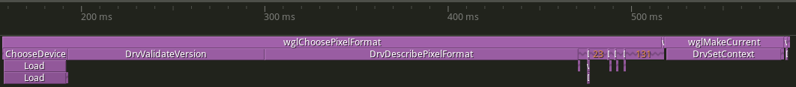

## GLGpuSelect: Solving OpenGL's Multi-GPU Problem Once and For All

### The Multi-GPU Dilemma

[GitHub Project](https://github.com/ArthurVasseur/GLGpuSelect)
[LinkedIn Post](https://www.linkedin.com/posts/arthur-vasseur_github-arthurvasseurglgpuselect-glgpuselect-activity-7332820557891072001-mlSg?utm_source=share&utm_medium=member_desktop&rcm=ACoAACrMhfoBEZ1bJDEgIEHIDpxYYHTt3AWDhto)

Today's "solutions" for GPU selection in OpenGL are a mess of workarounds. You have to either:
- Manually configure each application in the NVIDIA Control Panel

- Add magic exports to your code (but only if you have an integrated GPU):
   ```c
   __declspec(dllexport) DWORD NvOptimusEnablement = 1;
   __declspec(dllexport) int AmdPowerXpressRequestHighPerformance = 1;
   ```

- Navigate Windows Settings > Graphics settings and manually add each .exe file

- Use vendor-specific environment variables that only work on certain systems

Welcome to one of OpenGL's most frustrating limitations - the lack of proper, cross-platform GPU selection. In an era where dual-GPU systems becoming more common, OpenGL applications are still struggling with something that should be trivial: choosing which GPU to use.

This is why I created **GLGpuSelect** - a drop-in replacement for `opengl32.dll` (Windows) and soon libGL.so (Linux) that finally brings per-application GPU selection to OpenGL without requiring any code changes.

### Why This Problem Exists

OpenGL was designed in the early 1990s when multi-GPU systems were virtually non-existent. The API assumes a single graphics context bound to a single GPU. While extensions like `WGL_NV_gpu_affinity` and `AMD_gpu_association` exist, they come with significant limitations:

- **WGL_NV_gpu_affinity** only works on NVIDIA Quadro cards

- **AMD_gpu_association** requires AMD hardware

- Both require modifying your application code

- Neither provides a cross-platform solution

- System-wide GPU selection affects all applications, not just yours

The "modern" workarounds aren't much better:
- NVIDIA Control Panel settings are per-executable and manual

- The `NvOptimusEnablement` / `AmdPowerXpressRequestHighPerformance` exports only work on systems with integrated GPUs and require recompiling

- Windows Graphics Settings require manual configuration for each application

- None of these solutions are portable or scriptable

### The Technical Challenge

The core challenge is intercepting and redirecting OpenGL calls at the system level. When an application calls OpenGL functions, it goes through several layers:

```
Application  -> OpenGL API (opengl32.dll) -> GPU Driver -> Hardware
```

The ICD (Installable Client Driver) loader is responsible for routing calls to the appropriate driver. On Windows, this is typically handled by `opengl32.dll`, while on Linux it's `libGL.so`. These system libraries were never designed with GPU selection in mind.

### How GLGpuSelect Works

**GLGpuSelect** acts as a shim layer that intercepts OpenGL calls before they reach the system's ICD loader:

```
Application -> GLGpuSelect -> Selected GPU's Driver -> Hardware
```

#### GPU Selection Methods

**GLGpuSelect** provides two ways to select a GPU:

**Environment Variables** (Zero code changes):
```bash
export `GLGPUS_ADAPTER_OS_INDEX`=1  # Select second GPU
./your_opengl_app
```

**C API** (For programmatic control):
```c
#include <GLGpuSelect.h>

// Enumerate available GPUs
uint32_t deviceCount = 0;
glgpusEnumerateDevices(&deviceCount, NULL);

AdapterInfo* adapters = malloc(deviceCount * sizeof(AdapterInfo));
glgpusEnumerateDevices(&deviceCount, adapters);

// Select GPU by UUID
glgpusChooseDevice(adapters[0].Uuid);

// Continue with normal OpenGL initialization
```

### The WGL Implementation

**GLGpuSelect** fully reimplements the entire WGL interface. In other words, it provides its own `wgl*` exports exactly as `opengl32.dll` would, so that every WGL call made by an application routes through **GLGpuSelect**. As a result, **GLGpuSelect** can control context creation, pixel‐format selection, and device‐context binding from the ground up.

#### The GPU Selection Process

GPU selection happens at the moment the application requests a pixel format, specifically when it calls either `glgpusChooseDevice` (if used) or `wglChoosePixelFormat`.

- Pre-selection via API: If your code calls `glgpusChooseDevice` before any OpenGL calls, **GLGpuSelect** locks in your chosen GPU immediately. All subsequent context creation steps automatically use that adapter.

- Fallback to Environment Variable: If you don’t call `glgpusChooseDevice`, the first invocation of `wglChoosePixelFormat` triggers GPU selection based on the `GLGPUS_ADAPTER_OS_INDEX` environment variable. In other words, as soon as `wglChoosePixelFormat` runs, **GLGpuSelect** reads `GLGPUS_ADAPTER_OS_INDEX` and binds the device context to that GPU.

No matter which path you take, once a GPU is bound at `wglChoosePixelFormat`, every later WGL call-context creation, swapping buffers, querying extensions uses the selected adapter.

#### Windows: D3DKMT

On Windows, **GLGpuSelect** taps into the lesser-known D3DKMT* API family-part of the [Windows Display Driver Model (WDDM)](https://learn.microsoft.com/en-us/windows-hardware/drivers/display/windows-vista-display-driver-model-design-guide) kernel interface. These Direct3D Kernel Mode Thunk calls let you query adapters at a low level, without ever creating a Direct3D device.

Using `D3DKMTEnumAdapters2` brings several key benefits over higher-level alternatives like DXGI:

- Zero extra setup: No DXGI factory or dummy device is needed-simply call the kernel API.

- Full adapter insights: Retrieve each GPU’s LUID, adapter type, driver version, and more in one go.

- Kernel-level accuracy: Pulls data directly from the display driver, ensuring it’s up-to-date and correct.

By building on `D3DKMTEnumAdapters2`, **GLGpuSelect** reliably discovers every available adapter.


#### Reverse-Engineering the Graphics Stack

Before diving into the ICD details, I spent significant time reverse-engineering the key pieces of the Windows OpenGL pipeline, namely `opengl32.dll`, the GDI layer, and both the AMD and NVIDIA ICD drivers, using [Ghidra](https://github.com/NationalSecurityAgency/ghidra). This process revealed exactly how Windows routes OpenGL calls under the hood:

- opengl32.dll
   - By examining its entry points in Ghidra, I traced how calls to `wgl*` functions eventually dispatch into the system’s ICD loader.

- gdi32.dll
   - Functions such as `GetPixelFormat` and `ChoosePixelFormat` act as user-mode wrappers that dispatch to the corresponding WGL entry points in `opengl32.dll`

- AMD & NVIDIA ICDs
   - Disassembling each vendor’s drv export functions (for example, `DrvSetPixelFormat`, `DrvCreateContext`, `DrvSetContext`) showed me how they populate and return their internal function tables.
   - By mapping out their calling conventions and table layouts, I confirmed how to intercept and forward every OpenGL function pointer correctly.

Since there is essentially no official documentation on how all these pieces fit together, reverse engineering was the only way to uncover the precise mechanism. Without vendor or Microsoft guides, Ghidra became essential to decode how `opengl32.dll`, the GDI layer, and each vendor’s ICD collaborate.

#### The ICD Driver Interface

Once the correct GPU's ICD is loaded, **GLGpuSelect** must also handle the low-level driver interface. The ICD exports a set of driver functions that `opengl32.dll` calls directly.

```c
// Core driver functions that GLGpuSelect uses
DrvSetPixelFormat()      // Binds the pixel format to the HDC
DrvDescribePixelFormat() // Returns pixel format capabilities
DrvCreateContext()       // Creates the actual GL rendering context
DrvCreateLayerContext()  // Creates overlay/underlay contexts
DrvDeleteContext()       // Destroys contexts
DrvSetContext()          // Makes a context current, returns GL function table
DrvShareLists()          // Enables resource sharing between contexts
DrvCopyContext()         // Copies state between contexts
DrvSwapBuffers()         // Presents the rendered frame
DrvGetProcAddress()      // Returns extension function pointers
DrvValidateVersion()     // Validates driver compatibility
```

The most critical of these is **DrvSetContext**. When called, it returns a complete OpenGL function table containing pointers to all OpenGL functions 1.1 and below, which **GLGpuSelect** uses to route all OpenGL calls.

1. Call the real driver's DrvSetContext to get the GPU-specific function table
2. Store this table associated with the context
3. Ensure all OpenGL calls are routed through the correct GPU's function table

This is why **GLGpuSelect** can provide true per-application GPU selection - it controls the entire chain from WGL entry points through ICD loading to the actual OpenGL function dispatch.

##### Timeline




This timeline illustrates the key stages of how **GLGpuSelect** intercepts WGL calls and orchestrates GPU selection and context binding at runtime, in a scenario where `glgpusChooseDevice` is not explicitly called.

When the application starts, it invokes `ChoosePixelFormat`, triggering the following chain of events:

**ChooseDevice**
   
At the very beginning of the pipeline, **GLGpuSelect**’s custom ChooseDevice logic runs. Here, the system determines which physical GPU to use-based either on the environment variable `GLGPUS_ADAPTER_OS_INDEX` or internal logic

**DrvValidateVersion**
   
Immediately after selecting the GPU, **GLGpuSelect** calls the ICD’s `DrvValidateVersion` to verify compatibility. This ensures that the targeted GPU's driver supports the expected interface. On NVIDIA systems, this call takes approximately 107 ms.

**DrvDescribePixelFormat**

Next, **GLGpuSelect** queries the ICD for available pixel formats on the selected GPU. The first call retrieves the number of supported formats (approx. 170 ms on NVIDIA).
Subsequent, shorter calls (the smaller blocks in the timeline) are repeated invocations of `DrvDescribePixelFormat` used to fetch detailed descriptions of each pixel format, which the application uses to select an appropriate one.

**DrvSetContext**
   
Finally, when the application calls `wglMakeCurrent`, the ICD’s `DrvSetContext` is invoked. This is the point where the driver binds the rendering context to the selected GPU and returns its full OpenGL dispatch table (i.e., all OpenGL 1.1 function pointers). This setup takes around 62 ms on NVIDIA.

#### Linux: Coming Soon

Linux support is planned but not yet implemented. The platform presents unique challenges with its Mesa/proprietary driver split and the complexity of the GLX/EGL ecosystem.

### The Road Ahead

**GLGpuSelect** is currently focused on Windows support, with Linux implementation planned. The core goal remains simple: provide a transparent, zero-configuration solution for GPU selection in OpenGL applications.

The project is open to contributions, especially from developers with experience in Linux graphics stack who want to help bring this functionality to more platforms.

### Conclusion

**GLGpuSelect** solves a problem that shouldn't exist. By providing a transparent, cross-platform solution for GPU selection in OpenGL applications, it removes a significant pain point for developers and users alike.

The fact that you can drop in a single DLL and suddenly have GPU selection in any OpenGL application feels almost magical - but it's just good engineering solving a real problem.

OpenGL may be showing its age, but with tools like **GLGpuSelect**, we can modernize the experience without waiting for the industry to move on completely. Sometimes the best solutions are the ones that just work, requiring no changes to existing code while solving real problems.

You can find **GLGpuSelect** on [GitHub](https://github.com/ArthurVasseur/GLGpuSelect), where it's available under a dual GPL-3.0/Commercial license. Whether you're a developer tired of fighting with GPU selection or a user who just wants their applications to use the right GPU, **GLGpuSelect** is here to help.

---
opengl gpu egl multi-gpu wgl opengl-context gpu-selection gpu-affinity gpu-association opengl select gpu choose gpu